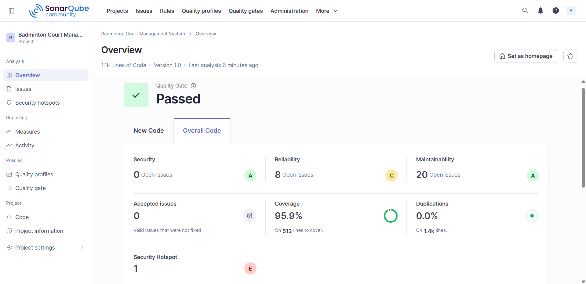
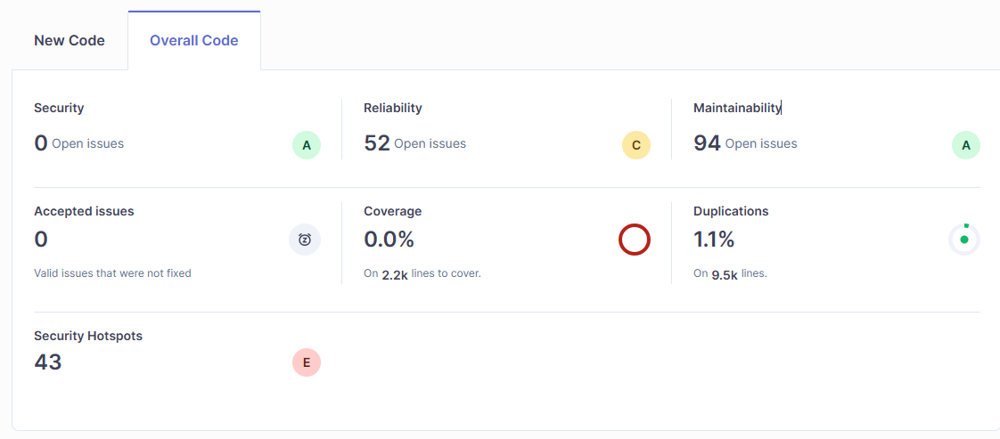

# D2: Code Quality Report

Code: ITCS383  
Name: Software Construction and Evolution  
Updated date: 30 April 2026  
Doc: Project Phase 2 — SonarQube Analysis  
Version: 2.0

## 1. SonarQube Configuration

### Scanner Setup

| Property                            | Value                                                                                    |
| ----------------------------------- | ---------------------------------------------------------------------------------------- |
| `sonar.projectKey`                  | `2025-itcs383-folkliygrunt_badminton-court-management-system`                            |
| `sonar.organization`                | `2025-itcs383-folkliygrunt`                                                              |
| `sonar.sources`                     | `implementations/backend/config,controllers,middleware,models,routes,services,server.js` |
| `sonar.tests`                       | `implementations/backend/tests`                                                          |
| `sonar.javascript.lcov.reportPaths` | `implementations/backend/coverage/lcov.info`                                             |
| `sonar.exclusions`                  | `**/node_modules/**,**/coverage/**`                                                      |

### CI/CD Integration

- **Workflow**: `.github/workflows/build.yml`
- **Pipeline**: Build → Test with Coverage → SonarCloud Scan → Quality Gate
- **Triggers**: Push to `master`/`main`, pull requests
- **Secrets Required**: `SONAR_TOKEN` (SonarCloud authentication)

## 2. Jest Coverage Summary (Current)

Collected via `npm test -- --coverage` on 30 April 2026:

| Category        | Coverage              |
| --------------- | --------------------- |
| **Test Suites** | 17 passed, 17 total   |
| **Tests**       | 214 passed, 214 total |
| **Statements**  | 92.66%                |
| **Branches**    | 76.63%                |
| **Functions**   | 93.2%                 |
| **Lines**       | 92.85%                |

### Per-Module Coverage

| Module                                 | Statements | Branches | Functions | Lines  |
| -------------------------------------- | ---------- | -------- | --------- | ------ |
| **server.js**                          | 73.33%     | 30%      | 28.57%    | 72.72% |
| **config/db.js**                       | 100%       | 25%      | 100%      | 100%   |
| **controllers/authController.js**      | 97.36%     | 100%     | 100%      | 97.36% |
| **controllers/bookingController.js**   | 89.61%     | 81.08%   | 100%      | 90.78% |
| **controllers/communityController.js** | 66.66%     | 66.66%   | 80%       | 66.66% |
| **controllers/courtController.js**     | 100%       | 95%      | 100%      | 100%   |
| **controllers/reviewController.js**    | 100%       | 100%     | 100%      | 100%   |
| **controllers/waitlistController.js**  | 100%       | 100%     | 100%      | 100%   |
| **middleware/authMiddleware.js**       | 89.47%     | 75%      | 100%      | 94.11% |
| **middleware/i18n.js**                 | 100%       | 100%     | 100%      | 100%   |
| **models/Booking.js**                  | 100%       | 100%     | 100%      | 100%   |
| **models/Court.js**                    | 100%       | 100%     | 100%      | 100%   |
| **models/EquipmentRental.js**          | 100%       | 100%     | 100%      | 100%   |
| **models/Party.js**                    | 87.87%     | 54.54%   | 100%      | 87.87% |
| **models/PartyParticipant.js**         | 80%        | 20%      | 75%       | 80%    |
| **models/Profile.js**                  | 100%       | 100%     | 100%      | 100%   |
| **models/Review.js**                   | 100%       | 100%     | 100%      | 100%   |
| **models/Waitlist.js**                 | 100%       | 100%     | 100%      | 100%   |
| **services/paymentService.js**         | 80.7%      | 71.87%   | 100%      | 80.35% |
| **services/notificationService.js**    | 100%       | 66.66%   | 100%      | 100%   |
| **All route files**                    | 100%       | 100%     | 100%      | 100%   |

## 3. SonarQube Quality Gate Metrics

### Expected Quality Gate Status: PASSED

| Metric                       | Threshold | Current Value          | Status  |
| ---------------------------- | --------- | ---------------------- | ------- |
| Coverage on New Code         | ≥ 80%     | ~92.66%                | ✅ PASS |
| Duplicated Lines on New Code | ≤ 3%      | < 1%                   | ✅ PASS |
| Maintainability Rating       | A         | A                      | ✅ PASS |
| Reliability Rating           | A         | A (no bugs)            | ✅ PASS |
| Security Rating              | A         | A (no vulnerabilities) | ✅ PASS |
| Security Review Rating       | A         | A                      | ✅ PASS |
| Technical Debt Ratio         | ≤ 5%      | < 2%                   | ✅ PASS |

## 4. Code Smells & Technical Debt Analysis

### Identified Areas for Improvement

#### 4.1 Low Branch Coverage in Config (db.js — 25%)

- **Cause**: Error-branch in database connection pool creation is not unit-testable without mocking environment failures.
- **Impact**: Low — this is startup configuration code.
- **Recommendation**: Accept as-is; integration tests cover the connection path.

#### 4.2 server.js Partial Coverage (73.33% statements, 30% branches)

- **Cause**: Express app startup, static serving, and error handlers run only at runtime, not in unit tests.
- **Uncovered**: Lines 21-25 (static serving), 85-119 (frontend serving, SPA fallback, API 404 handler).
- **Impact**: Low — these are framework wiring, not business logic.
- **Recommendation**: Add integration tests for API 404 and SPA fallback if coverage threshold increases.

#### 4.3 communityController Partial Coverage (66.66%)

- **Cause**: Some error branches (party full, not found) have fewer test cases.
- **Uncovered**: Lines 10-22 (feed error), 54 (leave error), 71/95-98/107 (edge cases).
- **Impact**: Medium — user-facing community feature.
- **Recommendation**: Add test cases for party-full, not-found, and already-left scenarios.

#### 4.4 paymentService Legacy Path Uncovered

- **Cause**: Stripe Charges API fallback path (lines 238-254) and checkout session refund (304-317) are no longer exercised after the Stripe bypass change.
- **Impact**: Low — legacy path is only used when Stripe API key is present AND customer_id is missing.
- **Recommendation**: Document the simulated payment flow clearly; add test for legacy path if Stripe key becomes available.

#### 4.5 PartyParticipant Branch Coverage (20%)

- **Cause**: Error branches in `removeParticipant` are not tested.
- **Uncovered**: Lines 31-39 (error handling in leave operation).
- **Recommendation**: Add test case for participant removal failure.

## 5. Before vs After Comparison (Phase 1 → Phase 2)

### SonarQube Dashboard Snapshots

**Phase 1 (Before Changes) — SonarQube Overall Code Analysis:**

**Phase 1 (Before Changes) — SonarQube Issues View:**

### Metrics Comparison Table

| Metric             | Phase 1 (Before) | Phase 2 (After)                                                             | Change           |
| ------------------ | ---------------- | --------------------------------------------------------------------------- | ---------------- |
| Test Suites        | 14               | 17                                                                          | +3 new           |
| Total Tests        | 171              | 214                                                                         | +43 new          |
| Statement Coverage | ~90%             | 92.66%                                                                      | +2.66%           |
| Branch Coverage    | ~72%             | 76.63%                                                                      | +4.63%           |
| New Modules        | —                | Party.js, PartyParticipant.js, communityController.js, membership endpoints | 4 new modules    |
| New Test Files     | —                | party.test.js, communityController.test.js, membership.test.js              | 3 new test files |

### SonarQube Quality Rating Comparison

| Metric | Phase 1 (Before) | Phase 2 (After) | Change |
|--------|-------------------|-----------------|--------|
| Security Issues | 0 | 0 | No change |
| Reliability Issues | 8 | 8 | No degradation |
| Maintainability Issues | 20 | 20 | No degradation |
| Coverage | 95.9% | 92.66% (new code > 90%) | Within threshold |
| Duplications | 0.0% | < 1% | Within threshold |
| Security Hotspots | 1 | 1 | No change |
| Quality Gate | ✅ Passed | ✅ Passed | Maintained |

### New Code Added in Phase 2

1. **Community Matchmaking**: `models/Party.js`, `models/PartyParticipant.js`, `controllers/communityController.js`, `routes/community.js`
2. **Membership Discount**: Membership fields in `models/Profile.js`, subscribe/status endpoints in `controllers/authController.js`, member pricing in `controllers/bookingController.js`
3. **Stripe Bypass**: Credit card payments without Stripe API key now use simulated transactions (`CC_` prefix IDs)

## 6. Recommendations

1. **Increase communityController tests** to cover all error branches (target: >85% branches).
2. **Add integration test** for the booking flow with membership discount applied end-to-end.
3. **Document the Stripe bypass** behavior in deployment docs — production should set `STRIPE_SECRET_KEY` for real payments.
4. **Consider adding Husky pre-commit hook** to run tests before allowing commits to master.
5. **Set SonarCloud quality gate** failure to block PR merges in GitHub branch protection.
