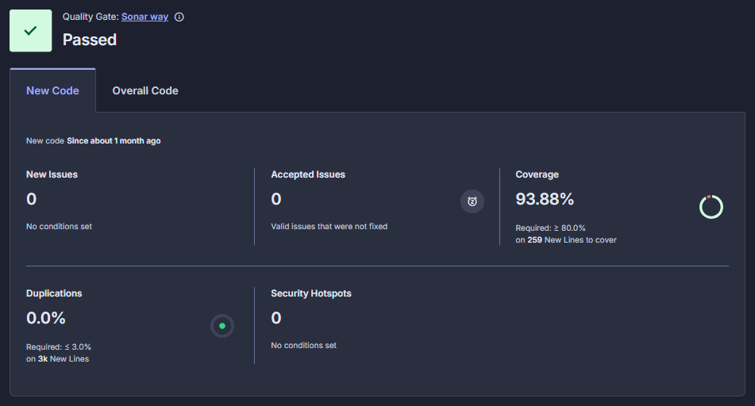
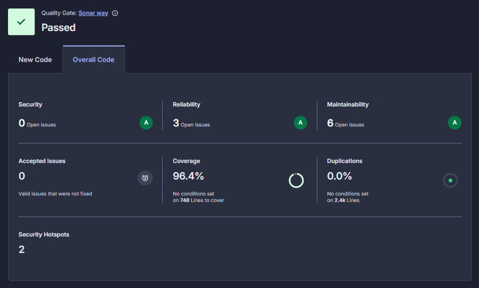
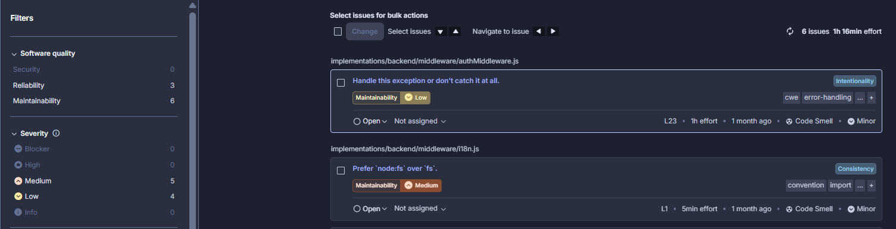

# Before vs After Comparison (Phase 1 → Phase 2)
## SonarQube Dashboard Snapshots

SonarCloud Project Link: https://sonarcloud.io/summary/new_code?id=antnpwr_2025-ITCS383-FolkliyGrunt&branch=master

### Phase 1 (Before Changes) 

SonarQube Overall Code Analysis:

SonarQube Issues View:

### Phase 2 (After changes) 
SonarQube New Code Analysis:

SonarQube Overall Code Analysis:

SonarQube Issues View:

| Metric                | Phase 1 (Before) | Phase 2 (After)  | Change           |
| --------------------- | ---------------- | ---------------- | ---------------- |
| New Issues            | 13               | 0                | Improved         |
| Overall Test Coverage | 95.9%            | 96.4%            | Improved         |
| New code Test Coverage| -                | 93.88%           | Improved         |
| Security              | 0                | 0                | No change        |
| Reliability           | 8                | 3                | Improved         |
| Maintainability       | 20               | 6                | Improved         |
| Blocker               | 0                | 0                | No change        |
| High                  | 9                | 0                | No change        |
| Medium                | 10               | 5                | Improved         |
| Low                   | 9                | 4                | Improved         |

## Conclusion
The comparison between Phase 1 and Phase 2 shows a clear improvement in code quality after the changes were applied. No new issues were introduced, and previously existing problems were significantly reduced, including the complete removal of all high-severity issues. Test coverage also improved overall, and the new code achieved a coverage of 93.88%, which is above the required 90% threshold, indicating that the added functionality is properly tested. At the same time, security and blocker issues remained at zero, confirming that no critical risks were introduced. Overall, these results demonstrate that the updates strengthened the project’s reliability and maintainability while keeping the system stable and meeting all quality requirements.
