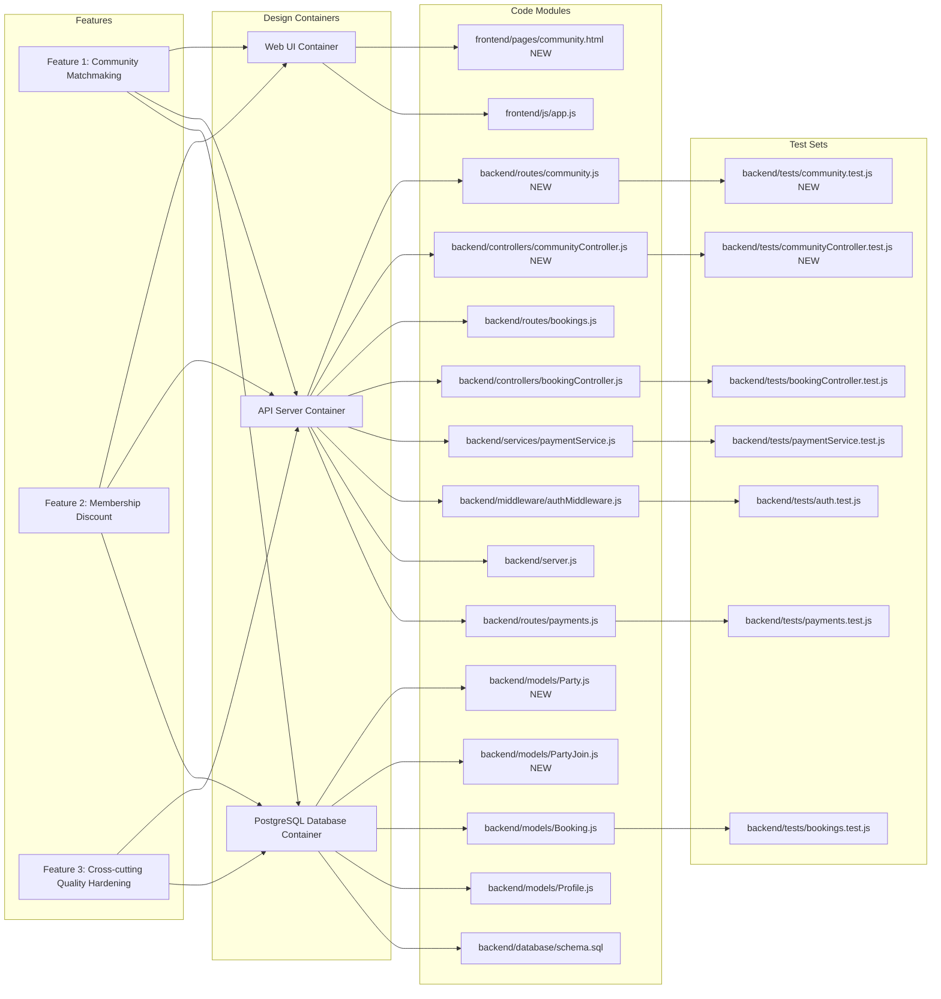
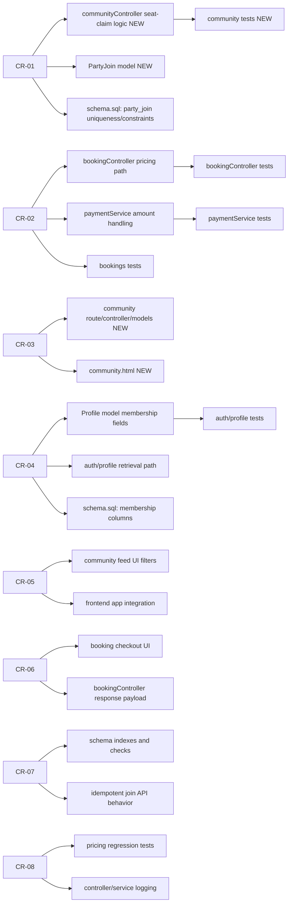
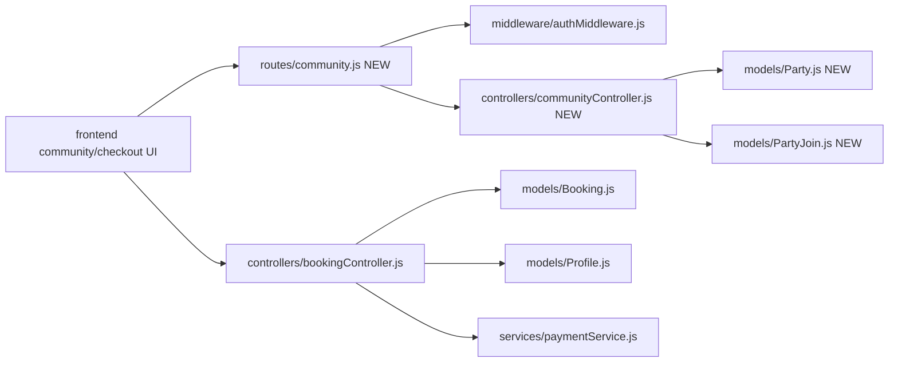
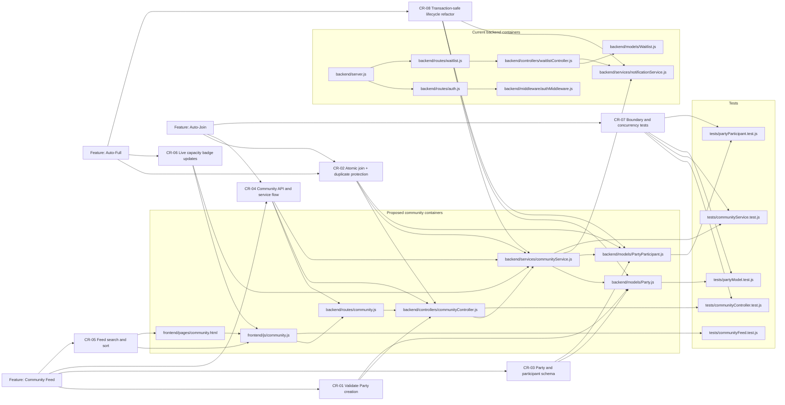
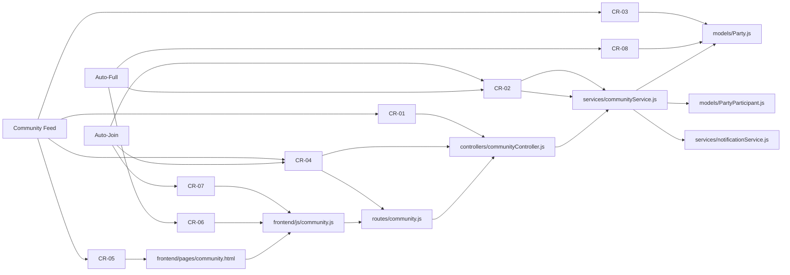
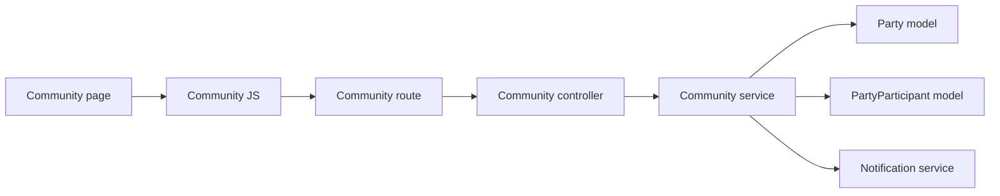

# D4: Impact Analysis

Code: ITCS383  
Name: Software Construction and Evolution  
Updated date: 27 April 2026  
Doc: Project Phase 2 Description  
Version: 1.0.0

## Scope

This impact analysis covers the two requested enhancements:

1. Community Matchmaking (Community Feed + Auto-Join until full)
2. Membership Discount System (199 THB subscription and 150 THB/hour member court rate)

The assignment text mentions three new features. In this deliverable, the third scope is treated as cross-cutting quality hardening from preventive CRs (data integrity, idempotency, regression guards), because those changes are required for stable rollout of both requested features.

## 1) Full Traceability Graph

The graph below connects Features -> Design Containers -> Code Modules -> Test Sets.

## 2) Affected-Only Traceability Graph

This version shows only the artifacts impacted by CR-01 to CR-08.

## 3) SLO Directed Graph (Code Modules Only)

Each node below is an SLO (software lifecycle object) at the module level.

## 4) Connectivity Matrix with Distances

Distance meaning:

- 0 = same node
- positive integer = shortest directed path length
- INF = no directed path

Node legend:

- J: frontend community/checkout UI
- A: routes/community.js NEW
- I: middleware/authMiddleware.js
- B: controllers/communityController.js NEW
- C: models/Party.js NEW
- D: models/PartyJoin.js NEW
- E: controllers/bookingController.js
- F: models/Booking.js
- G: models/Profile.js
- H: services/paymentService.js

| From\\To |   J |   A |   I |   B |   C |   D |   E |   F |   G |   H |
| -------- | --: | --: | --: | --: | --: | --: | --: | --: | --: | --: |
| J        |   0 |   1 |   2 |   2 |   3 |   3 |   1 |   2 |   2 |   2 |
| A        | INF |   0 |   1 |   1 |   2 |   2 | INF | INF | INF | INF |
| I        | INF | INF |   0 | INF | INF | INF | INF | INF | INF | INF |
| B        | INF | INF | INF |   0 |   1 |   1 | INF | INF | INF | INF |
| C        | INF | INF | INF | INF |   0 | INF | INF | INF | INF | INF |
| D        | INF | INF | INF | INF | INF |   0 | INF | INF | INF | INF |
| E        | INF | INF | INF | INF | INF | INF |   0 |   1 |   1 |   1 |
| F        | INF | INF | INF | INF | INF | INF | INF |   0 | INF | INF |
| G        | INF | INF | INF | INF | INF | INF | INF | INF |   0 | INF |
| H        | INF | INF | INF | INF | INF | INF | INF | INF | INF |   0 |

## 5) Change Difficulty Assessment

### Which change requests are easy to apply and why?

1. CR-06 (Perfective checkout transparency): Mostly presentation-level updates in booking response and frontend summary rendering, low architectural risk.
2. CR-05 (Perfective feed usability): Primarily frontend enhancements (filters, badges, counters) after base feed API exists.
3. CR-08 (Preventive tests and logging): Incremental extension of existing test and log patterns in the codebase.

### Which change requests are difficult to apply and why?

1. CR-03 (Adaptive Community Matchmaking foundation): Introduces new domain entities and API surface, requiring schema, route, controller, and UI integration.
2. CR-04 (Adaptive membership lifecycle): Requires precise status semantics (active/expired/renewal) and consistency across authentication/profile/booking boundaries.
3. CR-01 (Corrective concurrency safety): Race conditions require transactional logic and robust concurrency test design.
4. CR-07 (Preventive data integrity and idempotency): Must align DB constraints with API behavior and avoid false positives during retries.

### To make maintenance easier, what is expected from previous developers?

1. Stable module contracts: clear request/response schemas for booking, payment, and profile endpoints.
2. Schema migration history: versioned SQL migrations instead of only a single schema snapshot.
3. Explicit business rule documentation: pricing rules, membership edge cases, and seat allocation semantics.
4. Better observability baseline: structured logs and consistent error codes across controllers.
5. Seed and test data fixtures: deterministic datasets for concurrency and pricing regression tests.
6. Cross-module ownership notes: identify maintainers and integration boundaries for each package.
   Community Matchmaking is best analyzed as three linked changes:

- Community Feed: publish Party announcements for browsing.
- Auto-Join: allow users to join a Party from the feed.
- Auto-Full: automatically mark a Party as Full when the capacity limit is reached.

The change requests in [D3_CHANGE_REQUESTS.md](D3_CHANGE_REQUESTS.md) map onto the existing application layers and the new Party lifecycle modules that the feature needs.

## 1. Full Traceability Graph

## 2. Affected-Only Traceability Graph

## 3. SLO Directed Graph

For the code-level impact view, the relevant SLOs are:

- S1: frontend/pages/community.html
- S2: frontend/js/community.js
- S3: routes/community.js
- S4: controllers/communityController.js
- S5: services/communityService.js
- S6: models/Party.js
- S7: models/PartyParticipant.js
- S8: services/notificationService.js

## 4. Connectivity Matrix With Distances

Distances are measured as directed hop counts in the SLO graph. `∞` means there is no forward path from the row SLO to the column SLO.

| From / To | S1  | S2  | S3  | S4  | S5  | S6  | S7  | S8  |
| --------- | --- | --- | --- | --- | --- | --- | --- | --- |
| S1        | 0   | 1   | 2   | 3   | 4   | 5   | 5   | 5   |
| S2        | ∞   | 0   | 1   | 2   | 3   | 4   | 4   | 4   |
| S3        | ∞   | ∞   | 0   | 1   | 2   | 3   | 3   | 3   |
| S4        | ∞   | ∞   | ∞   | 0   | 1   | 2   | 2   | 2   |
| S5        | ∞   | ∞   | ∞   | ∞   | 0   | 1   | 1   | 1   |
| S6        | ∞   | ∞   | ∞   | ∞   | ∞   | 0   | ∞   | ∞   |
| S7        | ∞   | ∞   | ∞   | ∞   | ∞   | ∞   | 0   | ∞   |
| S8        | ∞   | ∞   | ∞   | ∞   | ∞   | ∞   | ∞   | 0   |

## 5. Maintenance Assessment

### Easy change requests

- CR-05 and CR-06 are the easiest because they mostly affect presentation logic in the community feed and do not change core data integrity rules.
- CR-07 is also straightforward because it adds tests around the new behavior rather than changing production logic.

### Difficult change requests

- CR-02 is the hardest because join operations must be atomic; otherwise two users can overfill the same Party at the same time.
- CR-03 and CR-04 are also difficult because they require schema changes, new persistence paths, and new API contracts to stay consistent across host and joiner workflows.

### What previous developers should have provided

- Clear ownership boundaries between feed rendering, join processing, and status transitions.
- Transaction-safe data access patterns with uniqueness constraints and documented invariants.
- A reusable notification and lifecycle service so the new feature can reuse existing patterns instead of duplicating logic.
- Focused unit tests around concurrency, capacity limits, and status updates.
