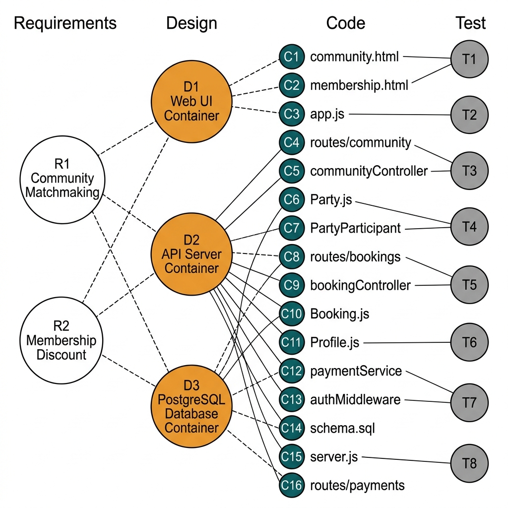
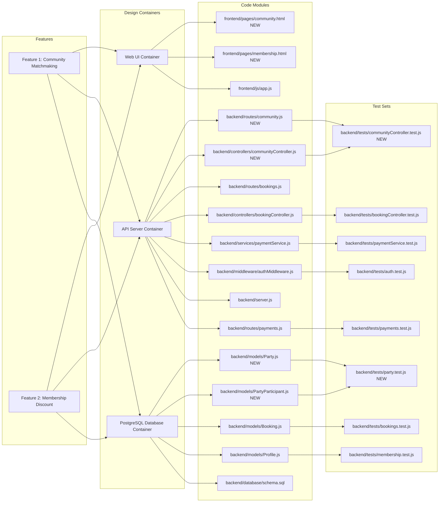
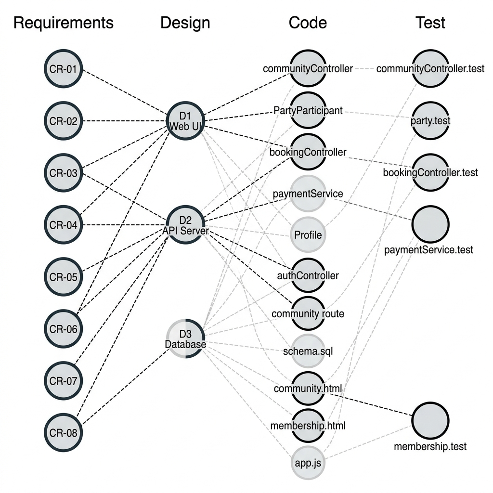
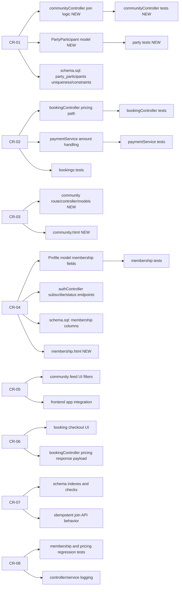
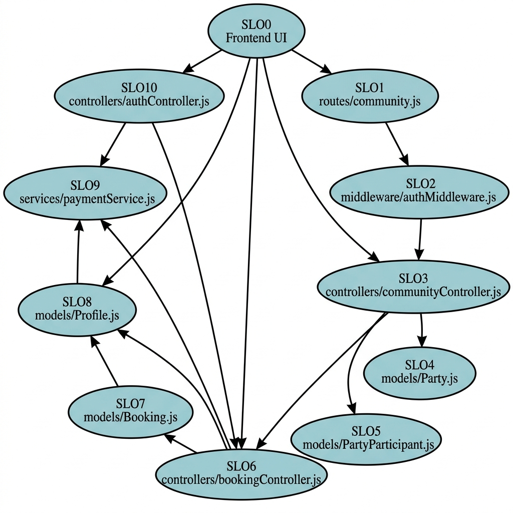
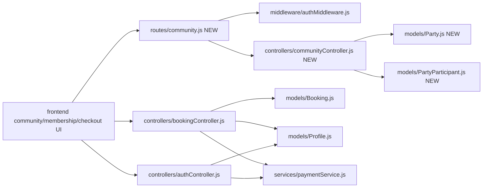
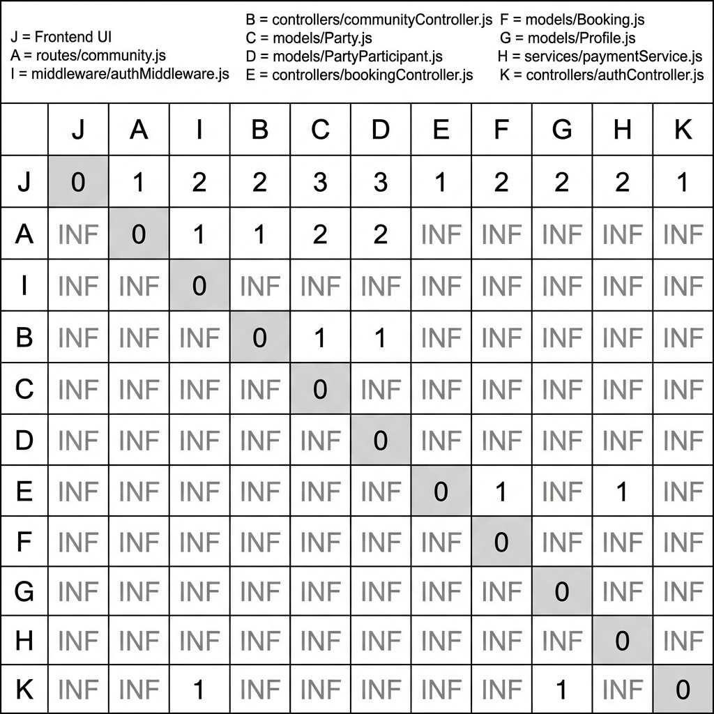

# D4: Impact Analysis

## Scope

This impact analysis covers the two requested enhancements:

1. Community Matchmaking (Community Feed + Auto-Join until full)
2. Membership Discount System (199 THB subscription and 150 THB/hour member court rate)

## 1) Full Traceability Graph

The graph below connects Features -> Design Containers -> Code Modules -> Test Sets.

**Graph Legend:**

| Column | Nodes |
|--------|-------|
| Requirements (R) | R1: Community Matchmaking, R2: Membership Discount |
| Design (D) | D1: Web UI Container, D2: API Server Container, D3: PostgreSQL Database Container |
| Code (C) | C1–C16: All source modules (see table below) |
| Test (T) | T1–T8: All test files |

**Code Module Mapping:**

| Code Node | Module |
|-----------|--------|
| C1 | frontend/pages/community.html *(NEW)* |
| C2 | frontend/pages/membership.html *(NEW)* |
| C3 | frontend/js/app.js |
| C4 | backend/routes/community.js *(NEW)* |
| C5 | backend/controllers/communityController.js *(NEW)* |
| C6 | backend/models/Party.js *(NEW)* |
| C7 | backend/models/PartyParticipant.js *(NEW)* |
| C8 | backend/routes/bookings.js |
| C9 | backend/controllers/bookingController.js |
| C10 | backend/models/Booking.js |
| C11 | backend/models/Profile.js |
| C12 | backend/services/paymentService.js |
| C13 | backend/middleware/authMiddleware.js |
| C14 | backend/database/schema.sql |
| C15 | backend/server.js |
| C16 | backend/routes/payments.js |

**Test File Mapping:**

| Test Node | Test File |
|-----------|-----------|
| T1 | backend/tests/communityController.test.js *(NEW)* |
| T2 | backend/tests/party.test.js *(NEW)* |
| T3 | backend/tests/bookings.test.js |
| T4 | backend/tests/bookingController.test.js |
| T5 | backend/tests/payments.test.js |
| T6 | backend/tests/paymentService.test.js |
| T7 | backend/tests/membership.test.js |
| T8 | backend/tests/auth.test.js |

**Traceability Connections:**

| From | To | Relationship |
|------|----|-------------|
| R1 (Community Matchmaking) | D1, D2, D3 | Requires UI, API, and DB changes |
| R2 (Membership Discount) | D1, D2, D3 | Requires UI, API, and DB changes |
| D1 (Web UI) | C1, C2, C3 | Frontend pages and scripts |
| D2 (API Server) | C4, C5, C8, C9, C12, C13, C15, C16 | Routes, controllers, services, middleware |
| D3 (Database) | C6, C7, C10, C11, C14 | Models and schema |
| C4, C5 | T1 | Community controller tests |
| C6, C7 | T2 | Party model tests |
| C9 | T4 | Booking controller tests |
| C10 | T3 | Booking model tests |
| C12 | T6 | Payment service tests |
| C16 | T5 | Payment route tests |
| C11 | T7 | Membership tests |
| C13 | T8 | Auth middleware tests |

Mermaid Source (click to expand)

## 2) Affected-Only Traceability Graph

This version shows only the artifacts impacted by CR-01 to CR-08.

**Change Request → Affected Artifact Mapping:**

| Change Request | Affected Artifacts |
|---------------|--------------------|
| CR-01 (Corrective: concurrency join) | communityController join logic, PartyParticipant model, schema.sql constraints |
| CR-02 (Corrective: pricing calculation) | bookingController pricing path, paymentService amount handling, bookings tests |
| CR-03 (Adaptive: community feature) | community route/controller/models *(NEW)*, community.html *(NEW)* |
| CR-04 (Adaptive: membership lifecycle) | Profile model membership fields, authController subscribe/status, schema.sql, membership.html *(NEW)* |
| CR-05 (Perfective: feed usability) | community feed UI filters, frontend app integration |
| CR-06 (Perfective: checkout transparency) | booking checkout UI, bookingController pricing response payload |
| CR-07 (Preventive: data integrity) | schema indexes and checks, idempotent join API behavior |
| CR-08 (Preventive: regression tests) | membership and pricing regression tests, controller/service logging |

Mermaid Source (click to expand)

## 3) SLO Directed Graph (Code Modules Only)

Each node below is an SLO (software lifecycle object) at the module level.

**SLO Node Legend:**

| SLO ID | Module | Description |
|--------|--------|-------------|
| SLO0 (J) | Frontend UI | community/membership/checkout pages |
| SLO1 (A) | routes/community.js *(NEW)* | Community feed route definitions |
| SLO2 (I) | middleware/authMiddleware.js | JWT auth verification |
| SLO3 (B) | controllers/communityController.js *(NEW)* | Community business logic |
| SLO4 (C) | models/Party.js *(NEW)* | Party domain model |
| SLO5 (D) | models/PartyParticipant.js *(NEW)* | Participant tracking model |
| SLO6 (E) | controllers/bookingController.js | Booking + member pricing logic |
| SLO7 (F) | models/Booking.js | Booking data model |
| SLO8 (G) | models/Profile.js | User profile + membership fields |
| SLO9 (H) | services/paymentService.js | Payment processing |
| SLO10 (K) | controllers/authController.js | Auth + membership endpoints |

**Directed Dependencies:**

| From | To | Dependency Reason |
|------|----|-------------------|
| J (Frontend) | A (community route) | API calls to community endpoints |
| J (Frontend) | E (bookingController) | API calls to booking/checkout |
| J (Frontend) | K (authController) | API calls to subscribe/status |
| A (community route) | I (authMiddleware) | Route requires authentication |
| A (community route) | B (communityController) | Route delegates to controller |
| B (communityController) | C (Party model) | Controller queries Party data |
| B (communityController) | D (PartyParticipant) | Controller manages participants |
| E (bookingController) | F (Booking model) | Controller manages bookings |
| E (bookingController) | G (Profile model) | Controller checks membership status |
| E (bookingController) | H (paymentService) | Controller delegates payment |
| K (authController) | G (Profile model) | Controller manages membership fields |
| K (authController) | H (paymentService) | Controller processes subscription payment |

Mermaid Source (click to expand)

## 4) Connectivity Matrix with Distances

Distance meaning:

- 0 = same node
- positive integer = shortest directed path length
- INF = no directed path

**Node Legend:**

| Symbol | SLO Module |
|--------|-----------|
| J | Frontend community/membership/checkout UI |
| A | routes/community.js *(NEW)* |
| I | middleware/authMiddleware.js |
| B | controllers/communityController.js *(NEW)* |
| C | models/Party.js *(NEW)* |
| D | models/PartyParticipant.js *(NEW)* |
| E | controllers/bookingController.js |
| F | models/Booking.js |
| G | models/Profile.js |
| H | services/paymentService.js |
| K | controllers/authController.js |

**Connectivity Matrix:**

| From\To |   J |   A |   I |   B |   C |   D |   E |   F |   G |   H |   K |
| -------- | --: | --: | --: | --: | --: | --: | --: | --: | --: | --: | --: |
| J        |   0 |   1 |   2 |   2 |   3 |   3 |   1 |   2 |   2 |   2 |   1 |
| A        | INF |   0 |   1 |   1 |   2 |   2 | INF | INF | INF | INF | INF |
| I        | INF | INF |   0 | INF | INF | INF | INF | INF | INF | INF | INF |
| B        | INF | INF | INF |   0 |   1 |   1 | INF | INF | INF | INF | INF |
| C        | INF | INF | INF | INF |   0 | INF | INF | INF | INF | INF | INF |
| D        | INF | INF | INF | INF | INF |   0 | INF | INF | INF | INF | INF |
| E        | INF | INF | INF | INF | INF | INF |   0 |   1 |   1 |   1 | INF |
| F        | INF | INF | INF | INF | INF | INF | INF |   0 | INF | INF | INF |
| G        | INF | INF | INF | INF | INF | INF | INF | INF |   0 | INF | INF |
| H        | INF | INF | INF | INF | INF | INF | INF | INF | INF |   0 | INF |
| K        | INF | INF | INF | INF | INF | INF | INF | INF |   1 |   1 |   0 |

**Key Observations from the Matrix:**

- **J (Frontend UI)** has the highest outgoing connectivity — it can reach all other nodes (max distance = 3), making it the most impactful module in terms of ripple effects from UI-level changes.
- **C, D, F, G, H (leaf models/services)** have no outgoing edges — they are dependency endpoints and are the safest to modify in isolation.
- **Two independent clusters** are visible:
  - **Community cluster**: J → A → {I, B → {C, D}}
  - **Booking/Membership cluster**: J → {E → {F, G, H}, K → {G, H}}
  - The clusters share G (Profile) and H (paymentService) as common downstream dependencies.

## 5) Change Difficulty Assessment

### Which change requests are easy to apply and why?

1. **CR-06 (Perfective — checkout transparency)**: Mostly presentation-level updates in booking response and frontend summary rendering. Low architectural risk because it only adds display fields to an existing API response without altering business logic. Connectivity matrix confirms F2 is a leaf node with no downstream impact.

2. **CR-05 (Perfective — feed usability)**: Primarily frontend enhancements (filters, badges, counters) after the base feed API exists. The community feed API is already complete, so this only touches the J (Frontend) node which, while widely connected, only requires additive JavaScript changes.

3. **CR-08 (Preventive — tests and logging)**: Incremental extension of existing test and log patterns in the codebase. Adding new test cases and structured logging does not change any runtime code paths — only observability and quality assurance tooling.

### Which change requests are difficult to apply and why?

1. **CR-03 (Adaptive — Community Matchmaking foundation)**: Introduces new domain entities (Party, PartyParticipant) and an entirely new API surface (routes, controller, models, UI). The traceability graph shows it creates 6 new artifacts (C1, C4, C5, C6, C7, T1, T2), requiring schema, route, controller, and UI integration across all three design containers.

2. **CR-04 (Adaptive — membership lifecycle)**: Requires precise status semantics (active/expired/renewal) and consistency across authentication/profile/booking boundaries. The connectivity matrix shows Profile.js (G) is a shared dependency for both E (bookingController) and K (authController), meaning a change to membership fields has ripple effects in two separate business logic paths.

3. **CR-01 (Corrective — concurrency safety)**: Race conditions require transactional logic (SELECT FOR UPDATE) and robust concurrency test design. The SLO graph shows B depends on both C and D, meaning the fix must be atomic across the controller and both model layers.

4. **CR-07 (Preventive — data integrity and idempotency)**: Must align DB constraints (schema.sql) with API behavior (communityController) and avoid false positives during retries. Requires careful coordination between D3 (database) and D2 (API server) containers.

### To make maintenance easier, what is expected from previous developers?

1. **Stable module contracts**: Clear request/response schemas for booking, payment, and profile endpoints with versioned API documentation.
2. **Schema migration history**: Versioned SQL migrations (e.g., using a migration tool like `knex` or `db-migrate`) instead of only a single schema snapshot.
3. **Explicit business rule documentation**: Pricing rules, membership edge cases, and seat allocation semantics documented alongside the code.
4. **Better observability baseline**: Structured logs (JSON format) and consistent error codes across all controllers for easier debugging.
5. **Seed and test data fixtures**: Deterministic datasets for concurrency and pricing regression tests, not just mocked unit tests.
6. **Cross-module ownership notes**: Identify maintainers and integration boundaries for each package to speed up change request routing.
