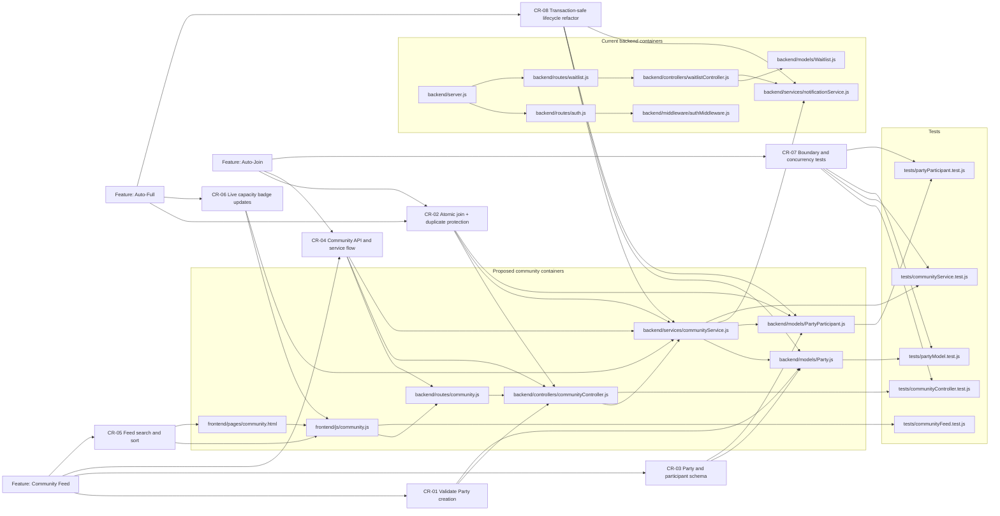
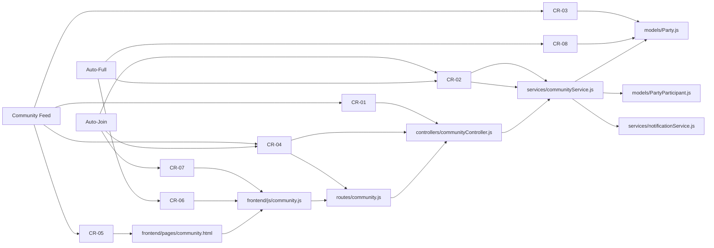
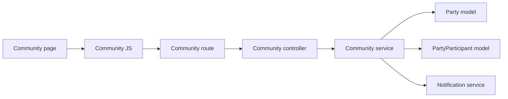

# D4: Impact Analysis

Community Matchmaking is best analyzed as three linked changes:

- Community Feed: publish Party announcements for browsing.
- Auto-Join: allow users to join a Party from the feed.
- Auto-Full: automatically mark a Party as Full when the capacity limit is reached.

The change requests in [D3_CHANGE_REQUESTS.md](D3_CHANGE_REQUESTS.md) map onto the existing application layers and the new Party lifecycle modules that the feature needs.

## 1. Full Traceability Graph

## 2. Affected-Only Traceability Graph

## 3. SLO Directed Graph

For the code-level impact view, the relevant SLOs are:

- S1: frontend/pages/community.html
- S2: frontend/js/community.js
- S3: routes/community.js
- S4: controllers/communityController.js
- S5: services/communityService.js
- S6: models/Party.js
- S7: models/PartyParticipant.js
- S8: services/notificationService.js

## 4. Connectivity Matrix With Distances

Distances are measured as directed hop counts in the SLO graph. `∞` means there is no forward path from the row SLO to the column SLO.

| From / To | S1  | S2  | S3  | S4  | S5  | S6  | S7  | S8  |
| --------- | --- | --- | --- | --- | --- | --- | --- | --- |
| S1        | 0   | 1   | 2   | 3   | 4   | 5   | 5   | 5   |
| S2        | ∞   | 0   | 1   | 2   | 3   | 4   | 4   | 4   |
| S3        | ∞   | ∞   | 0   | 1   | 2   | 3   | 3   | 3   |
| S4        | ∞   | ∞   | ∞   | 0   | 1   | 2   | 2   | 2   |
| S5        | ∞   | ∞   | ∞   | ∞   | 0   | 1   | 1   | 1   |
| S6        | ∞   | ∞   | ∞   | ∞   | ∞   | 0   | ∞   | ∞   |
| S7        | ∞   | ∞   | ∞   | ∞   | ∞   | ∞   | 0   | ∞   |
| S8        | ∞   | ∞   | ∞   | ∞   | ∞   | ∞   | ∞   | 0   |

## 5. Maintenance Assessment

### Easy change requests

- CR-05 and CR-06 are the easiest because they mostly affect presentation logic in the community feed and do not change core data integrity rules.
- CR-07 is also straightforward because it adds tests around the new behavior rather than changing production logic.

### Difficult change requests

- CR-02 is the hardest because join operations must be atomic; otherwise two users can overfill the same Party at the same time.
- CR-03 and CR-04 are also difficult because they require schema changes, new persistence paths, and new API contracts to stay consistent across host and joiner workflows.

### What previous developers should have provided

- Clear ownership boundaries between feed rendering, join processing, and status transitions.
- Transaction-safe data access patterns with uniqueness constraints and documented invariants.
- A reusable notification and lifecycle service so the new feature can reuse existing patterns instead of duplicating logic.
- Focused unit tests around concurrency, capacity limits, and status updates.
