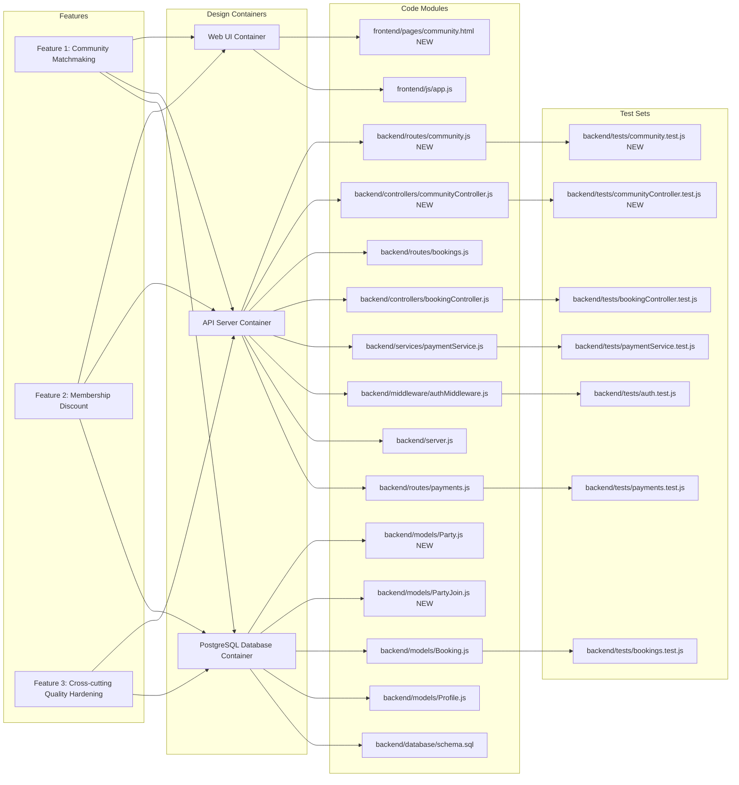
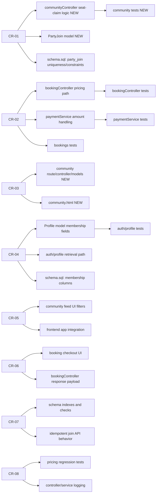
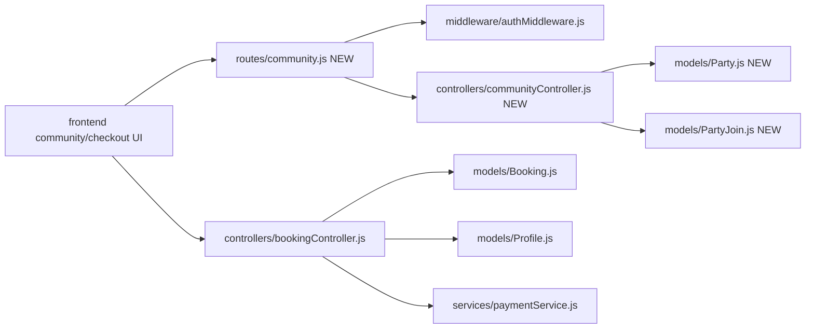

# D4: Impact Analysis

Code: ITCS383  
Name: Software Construction and Evolution  
Updated date: 27 April 2026  
Doc: Project Phase 2 Description  
Version: 1.0.0

## Scope

This impact analysis covers the two requested enhancements:

1. Community Matchmaking (Community Feed + Auto-Join until full)
2. Membership Discount System (199 THB subscription and 150 THB/hour member court rate)

The assignment text mentions three new features. In this deliverable, the third scope is treated as cross-cutting quality hardening from preventive CRs (data integrity, idempotency, regression guards), because those changes are required for stable rollout of both requested features.

## 1) Full Traceability Graph

The graph below connects Features -> Design Containers -> Code Modules -> Test Sets.

## 2) Affected-Only Traceability Graph

This version shows only the artifacts impacted by CR-01 to CR-08.

## 3) SLO Directed Graph (Code Modules Only)

Each node below is an SLO (software lifecycle object) at the module level.

## 4) Connectivity Matrix with Distances

Distance meaning:

- 0 = same node
- positive integer = shortest directed path length
- INF = no directed path

Node legend:

- J: frontend community/checkout UI
- A: routes/community.js NEW
- I: middleware/authMiddleware.js
- B: controllers/communityController.js NEW
- C: models/Party.js NEW
- D: models/PartyJoin.js NEW
- E: controllers/bookingController.js
- F: models/Booking.js
- G: models/Profile.js
- H: services/paymentService.js

| From\\To |   J |   A |   I |   B |   C |   D |   E |   F |   G |   H |
| -------- | --: | --: | --: | --: | --: | --: | --: | --: | --: | --: |
| J        |   0 |   1 |   2 |   2 |   3 |   3 |   1 |   2 |   2 |   2 |
| A        | INF |   0 |   1 |   1 |   2 |   2 | INF | INF | INF | INF |
| I        | INF | INF |   0 | INF | INF | INF | INF | INF | INF | INF |
| B        | INF | INF | INF |   0 |   1 |   1 | INF | INF | INF | INF |
| C        | INF | INF | INF | INF |   0 | INF | INF | INF | INF | INF |
| D        | INF | INF | INF | INF | INF |   0 | INF | INF | INF | INF |
| E        | INF | INF | INF | INF | INF | INF |   0 |   1 |   1 |   1 |
| F        | INF | INF | INF | INF | INF | INF | INF |   0 | INF | INF |
| G        | INF | INF | INF | INF | INF | INF | INF | INF |   0 | INF |
| H        | INF | INF | INF | INF | INF | INF | INF | INF | INF |   0 |

## 5) Change Difficulty Assessment

### Which change requests are easy to apply and why?

1. CR-06 (Perfective checkout transparency): Mostly presentation-level updates in booking response and frontend summary rendering, low architectural risk.
2. CR-05 (Perfective feed usability): Primarily frontend enhancements (filters, badges, counters) after base feed API exists.
3. CR-08 (Preventive tests and logging): Incremental extension of existing test and log patterns in the codebase.

### Which change requests are difficult to apply and why?

1. CR-03 (Adaptive Community Matchmaking foundation): Introduces new domain entities and API surface, requiring schema, route, controller, and UI integration.
2. CR-04 (Adaptive membership lifecycle): Requires precise status semantics (active/expired/renewal) and consistency across authentication/profile/booking boundaries.
3. CR-01 (Corrective concurrency safety): Race conditions require transactional logic and robust concurrency test design.
4. CR-07 (Preventive data integrity and idempotency): Must align DB constraints with API behavior and avoid false positives during retries.

### To make maintenance easier, what is expected from previous developers?

1. Stable module contracts: clear request/response schemas for booking, payment, and profile endpoints.
2. Schema migration history: versioned SQL migrations instead of only a single schema snapshot.
3. Explicit business rule documentation: pricing rules, membership edge cases, and seat allocation semantics.
4. Better observability baseline: structured logs and consistent error codes across controllers.
5. Seed and test data fixtures: deterministic datasets for concurrency and pricing regression tests.
6. Cross-module ownership notes: identify maintainers and integration boundaries for each package.
