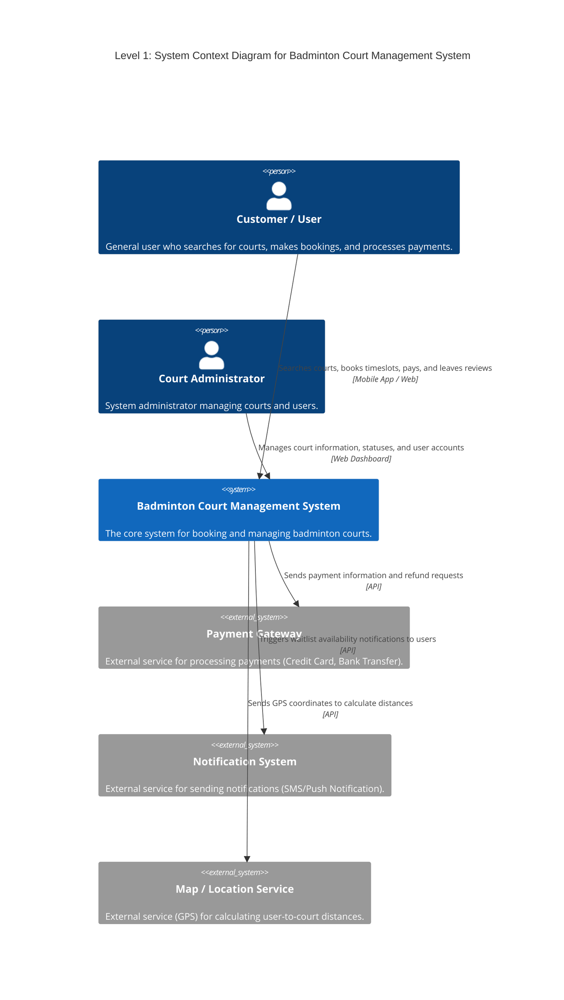
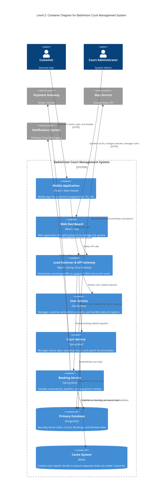
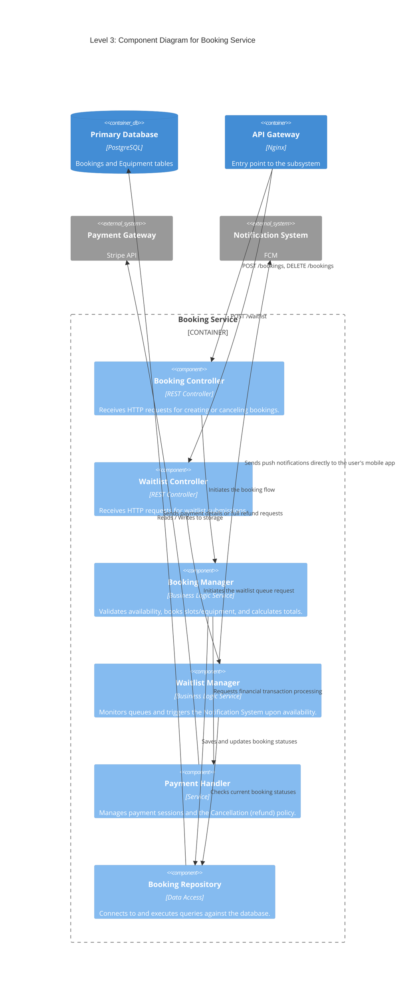
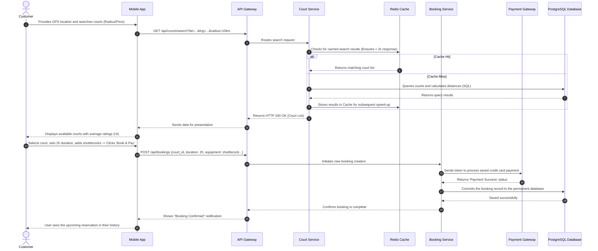
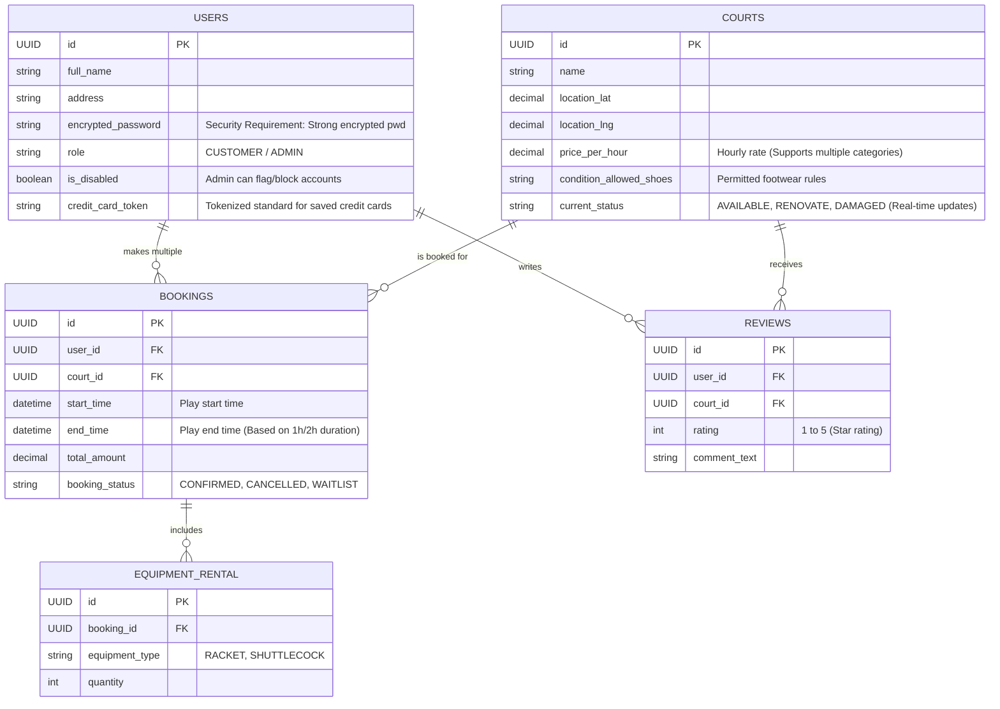

# Design Models and Design Rationale (Deliverable D1)

This document describes the software architecture of the **Badminton Court Management System** based on the project requirements. It includes C4 Model diagrams (Context, Container, Component), a Sequence Diagram for a core demo case, and an Entity Relationship (ER) Diagram to illustrate the system structure.

---

## 1. C4 Diagrams

### Level 1: System Context Diagram
An overview showing the relationship between the main system, users (Customer & Admin), and external systems.

**Design Rationale:**
*   **Separation of External Systems (Third-Party Services):** Map Services (for calculating 1km, 2km, and 10km radii), Notification Systems (for the waitlist feature), and the Payment Gateway are all integrated via external APIs. This reduces the load on the core system and avoids the liabilities of directly storing sensitive credit card information, satisfying the system's strict Security Requirements.

---

### Level 2: Container Diagram
The container-level architecture shows the high-level technology stack and components designed to support up to 1,000 concurrent users.

**Design Rationale:**
*   **Microservices-lite Architecture & Load Balancing:** Decomposing the backend into 3 main services (User, Court, Booking) behind a Load Balancer ensures the system can handle massive peaks in traffic. This fulfills the Non-Functional Requirement of supporting 1,000 concurrent users.
*   **Redis Caching:** For the advanced search features (name, distance, price range), repeatedly querying the database is slow. Implementing Redis Cache between the services guarantees that search processing and displaying results take **no longer than 2 seconds** (Performance Requirement).
*   **Localization Support:** The Mobile App container is structurally planned to support 3 languages (TH, EN, ZH) as per the requirements.

---

### Level 3: Component Diagram (Booking Service)
The internal component structure of the core Booking Service.

**Design Rationale:**
*   **Decoupled Waitlist & Payment Modules:** The Waitlist is managed by its own dedicated component that monitors court availability. When a reserved court is canceled, this manager immediately triggers a notification through the External Notification System, strictly following the waitlist requirement.
*   **Cancellation Flow:** The Payment Handler specifically accommodates full refunds directly via the external gateway if a user cancels before the play session begins.
*   **Component Boundaries:** Dividing logic into specialized modules makes the code highly modular and maintainable. This also allows modifying the financial calculation component without impacting the core reservation flow.

---

## 2. Sequence Diagram (Demo Case)

A demonstration workflow when a customer searches for a court, selects a timeslot, adds equipment, and successfully completes a credit card payment.

**Design Rationale:**
*   **Guaranteed Response Time (Performance Limit):** The workflow prioritizes retrieving search results from the Redis cache. This prevents database bottlenecks, ensuring that even with massive concurrent usage, the search returns results extremely quickly.
*   **Atomic Transactions for Bookings:** The system requires the external payment to succeed before committing the reservation to its own database. This prevents "race conditions" where an unpaid cart permanently blocks an available timeslot.

---

## 3. Entity Relationship Diagram (ER Diagram)

The database schema design for the Badminton Court Management System using a Relational Database.

**Design Rationale:**
*   **`is_disabled` in USERS:** Fulfills the requirement giving Administrators the authority to block inappropriate customers from logging into the platform.
*   **`current_status` in COURTS:** Meets the requirement for real-time status updates (e.g., renovations or equipment damage) by admins. This status is actively read by the search service to prevent users from booking unavailable courts.
*   **Normalized EQUIPMENT_RENTAL & REVIEWS tables:** Decoupling optional information keeps the core `BOOKINGS` table as small and performant as possible. This optimization heavily benefits read queries when serving large numbers of concurrent users, while saving storage space.
