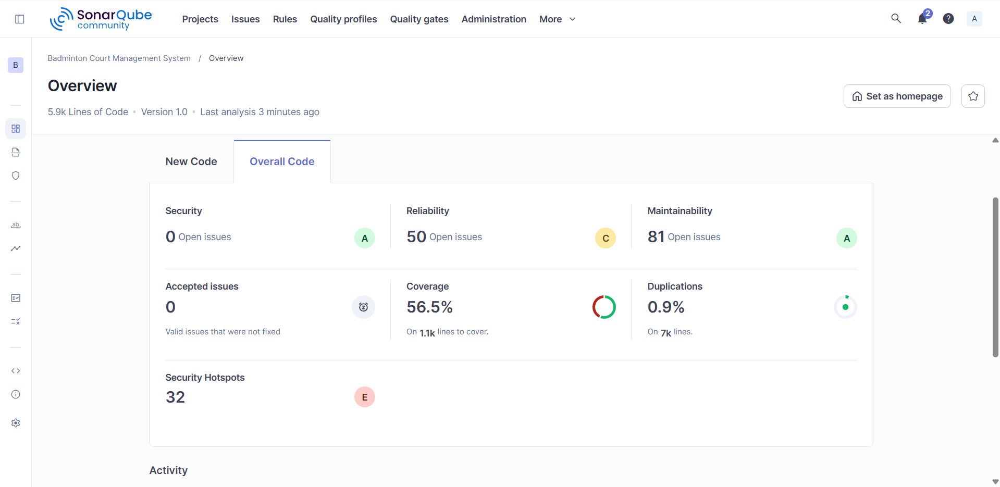

# Features

## Authentication & Profiles  
- Secure user management powered by Supabase Auth.  
- Users can register as either **customers** or **staff**.  
- During registration, users must provide their full name, email, password, and address.  
- After completing the required fields, users can choose their account type (customer or staff).  
- For login, users must enter a valid email and password.  

---

## Search  
- Dynamic search functionality based on **court name**, **distance** (using Haversine formula and OpenStreetMap Geocoding), and **maximum price**.  
- It provide a **Explore on Map** that allow users to find courts near their location.
- Search results display a list of available badminton courts, along with a **“Show All”** option.  
- Each court listing includes:
  - Court name  
  - Opening and closing hours  
  - Shoe requirements  
  - Star rating  
  - Price (THB per hour)  
- Each court also provides a **“View Details”** option, which displays:
  - Location with an embedded map  
  - User reviews  
  - A **“Book This Court”** button  

---

## Booking & Rentals  
- Supports secure and concurrent time-slot reservations with optional equipment rentals (rackets, shuttlecocks, shoes).  
- Users can:
  - Select a court  
  - Choose a time slot  
  - Add equipment rentals  
- Booking form includes:
  - Court (pre-selected when booking from the court page)  
  - Time slot (MM/DD/YYYY HH:MM)  
  - Duration (1–3 hours)  
  - Payment method (credit card, bank transfer, PromptPay)  
  - Equipment rental options  
- The system displays a cost breakdown:
  - Court fee  
  - Equipment rental cost  
  - Total amount  
- Users can proceed with **“Pay Now”** to confirm the booking.  
- Users can access their reservations via the **“My Bookings”** page.  

---

## Waitlists  
- Automated FIFO (First-In, First-Out) waitlist system.  
- Email notifications (via Nodemailer) are sent when a slot becomes available due to cancellations.  

---

## Reviews  
- Verified review system to ensure authenticity.  
- Court ratings are dynamically recalculated upon new review submissions.  

---

## Language Support
- The system support Thai, English, and Chinese language.

---  


# Design Verification Results  
*(To be completed)*  

---

# Reflections  

## Technologies Used  

| Layer              | Technology                                                        |
|--------------------|-------------------------------------------------------------------|
| Frontend           | Vanilla HTML, CSS, JavaScript (served via Express)               |
| Backend            | Node.js with Express.js (Monolithic Architecture)                |
| Database           | PostgreSQL (hosted on Supabase) with `pg`                        |
| Authentication     | Supabase Auth                                                    |
| API & Server       | REST API via Express.js                                          |
| Search & Geolocation | Haversine Formula + OpenStreetMap Geocoding                   |
| Payment            | Stripe                                                           |
| Email/Notifications| Nodemailer (SMTP via Mailtrap)                                   |
| Testing            | Jest, Supertest                                                  |
| Security           | Helmet, CORS                                                     |

---

## Required Information  

### Setup Requirements  
- **Node.js**: v20 LTS recommended  
- **npm**: Node package manager  
- **Supabase Account**: Use the provided remote project configuration  

---

### Environment Variables  
Create a `.env` file in the `implementations` directory and configure it with your Supabase and external API credentials:

```env
PORT=8080

DB_USER=...
DB_HOST=...
DB_NAME=postgres
DB_PASS=...
DB_PORT=5432

SUPABASE_URL=...
SUPABASE_ANON_KEY=...
SUPABASE_SERVICE_ROLE_KEY=...

SMTP_HOST=sandbox.smtp.mailtrap.io
SMTP_PORT=587
SMTP_USER=...
SMTP_PASS=...
```

### Build Instructions  

1. Navigate to the implementation folder:
```bash
cd implementations
```

2. Install dependencies:
```bash
npm install
```

---

### Run Commands  

- **Development Mode** (with hot reload):
```bash
npm run dev
```

- **Production Mode**:
```bash
npm start
```

- **Run Tests**:
```bash
npm test
```

---

## Code Quality  



### Code quality analysis 
The project has no blocker issues, but there are a few high severity issues.  
The analysis shows the distribution of issues based on severity levels:
- Blocker: 0
- High: 14
- Medium: 61
- Low: 53
- Info: 0  
  
The overall code have:
- Security issues: 0
- Reliability issues: 50
- Maintainability issues: 81
- Accepted issues: 0
- Coverage: 56.6%
- Duplication: 0.9%
- Security hotspots: 32