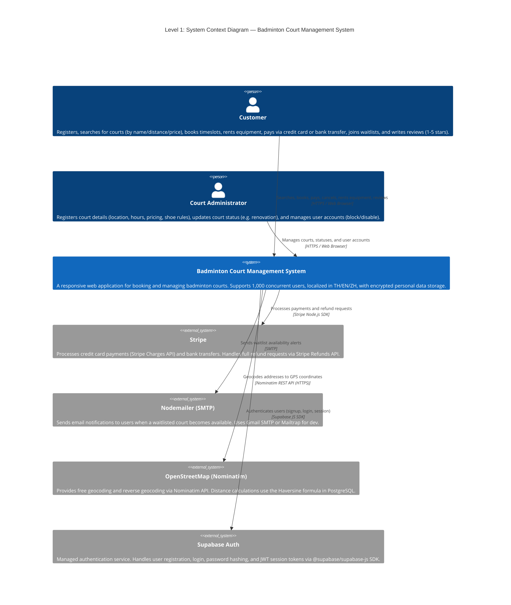
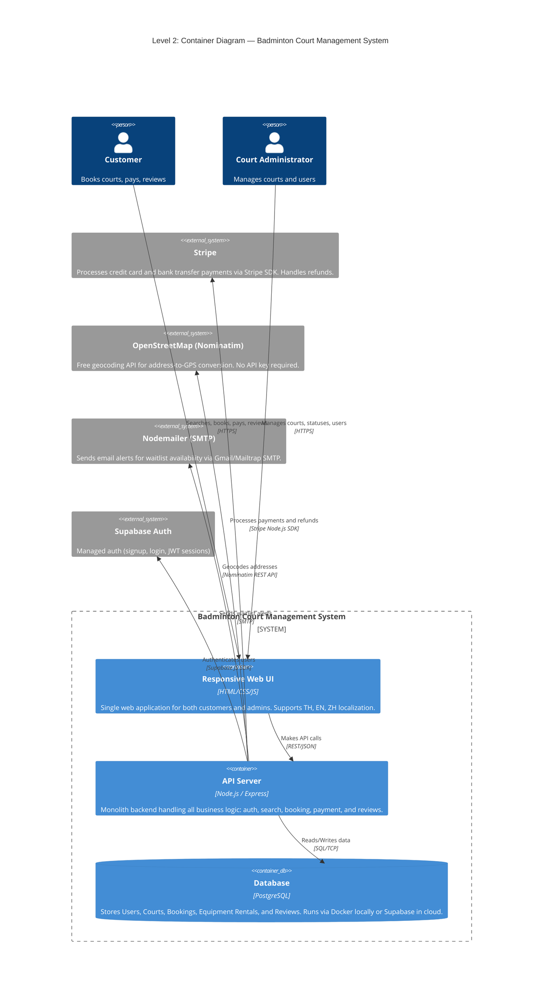
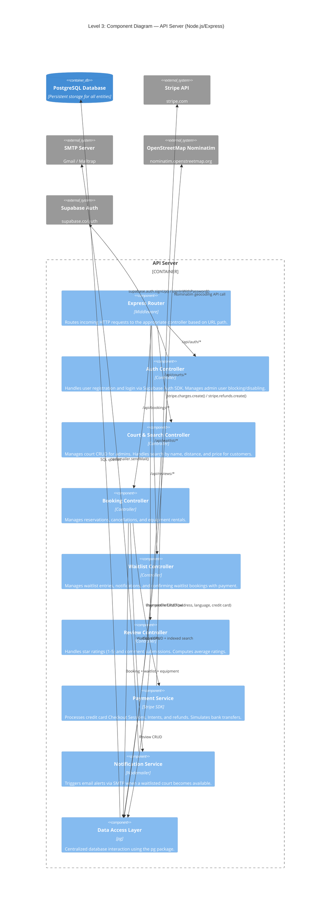
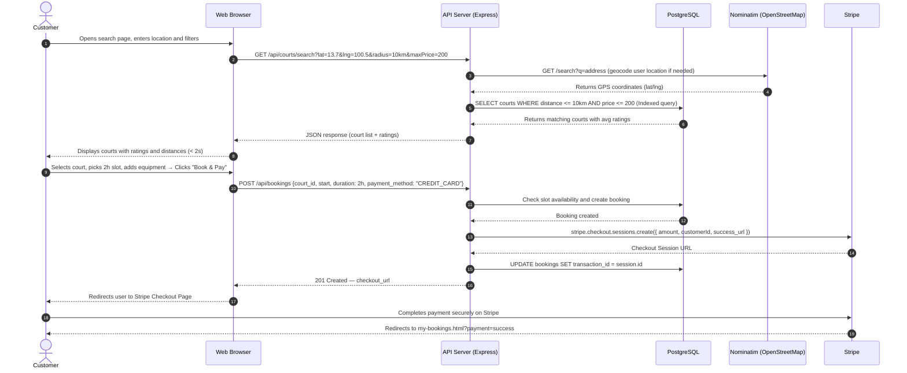
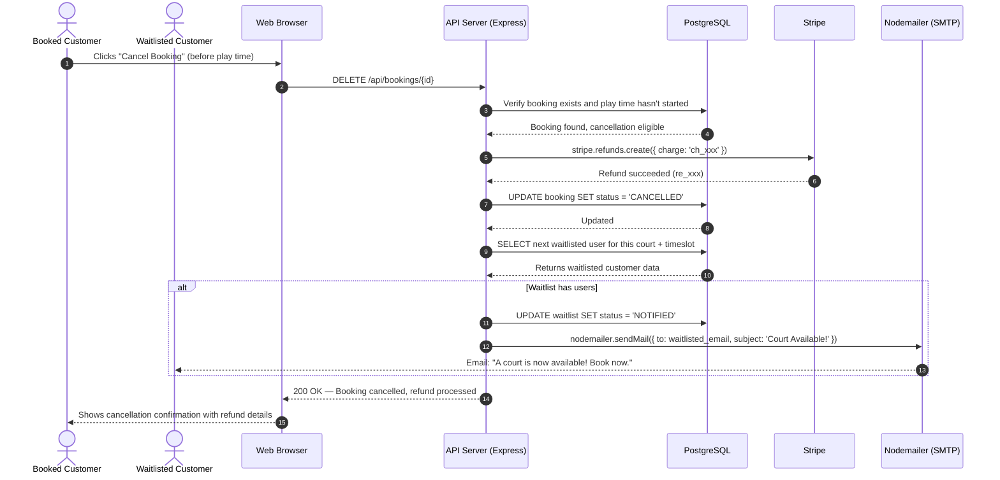
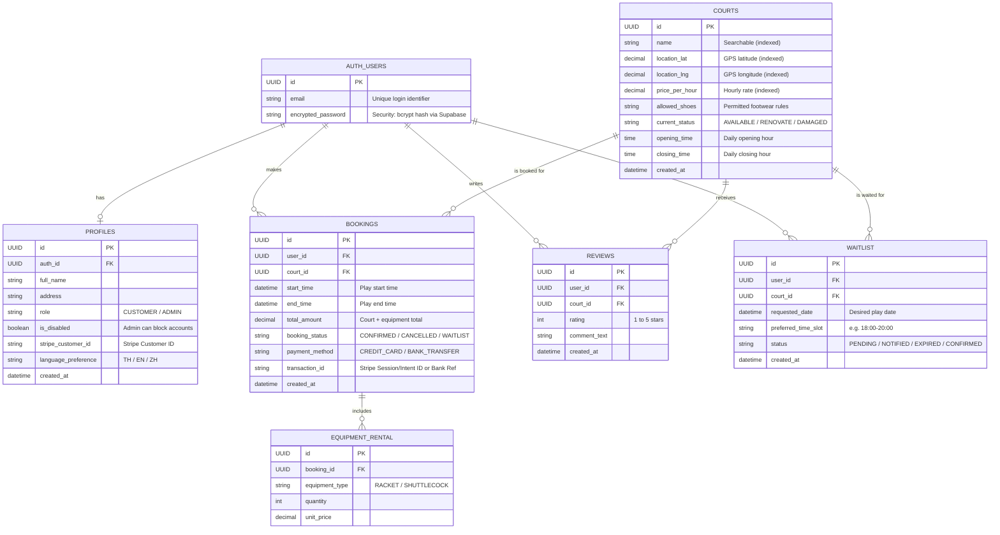

# Design Models and Design Rationale (Deliverable D1)

This document describes the software architecture of the **Badminton Court Management System** based on the project requirements. It includes C4 Model diagrams (Context, Container, Component), a Sequence Diagram for a core demo case, and an Entity Relationship (ER) Diagram to illustrate the system structure.

---

## 1. C4 Diagrams

### Level 1: System Context Diagram
An overview showing the relationship between the main system, the two types of users (Customer & Administrator), and the external third-party systems required to fulfill all functional and non-functional requirements.

**Design Rationale:**

| Requirement | How the Context Diagram Addresses It |
|---|---|
| **Concurrency (1,000 users)** | The system boundary description explicitly states the NFR. A single, well-optimized monolith on Node.js handles this via its non-blocking I/O event loop. |
| **Security (Encryption)** | All relationships use HTTPS. Sensitive data (credit cards, passwords) is stored encrypted within the system, and actual payment processing is delegated to **Stripe** (PCI-DSS Level 1 certified), avoiding direct PCI liability. |
| **Search (Name/Distance/Price)** | **OpenStreetMap Nominatim API** (free geocoding, no API key) converts addresses to GPS coordinates. Distance search (1km/2km/10km radius) uses the **Haversine formula in PostgreSQL** for fast, server-side calculations. Name and price filtering use PostgreSQL indexes. |
| **Waitlist & Notification** | **Nodemailer** sends email alerts via SMTP (Gmail or Mailtrap for dev) when a waitlisted court becomes available, ensuring reliable delivery decoupled from core booking logic. |
| **Payment & Cancellation** | **Stripe Charges API** handles credit card payments; **Stripe Refunds API** processes full refunds for cancellations (if play time hasn't started). Bank transfers are simulated via Stripe's test mode. |
| **Localization (TH/EN/ZH)** | Stated in the system description. Implemented internally via a JSON-based i18n translation layer. |
| **Equipment Rental** | Included in the Customer's relationship label ("rents equipment"). Managed as part of the booking flow within the system. |
| **Review System (1-5 stars)** | Included in the Customer's relationship label ("reviews"). Average ratings are displayed alongside court search results. |

---

### Level 2: Container Diagram
The container-level view shows the simplified, monolithic technology stack designed for easy local deployment and high performance.

**Design Rationale:**
*   **Monolith Architecture (Node.js/Express):** A single API server simplifies development, testing, and deployment. Node.js's non-blocking event loop efficiently handles 1,000 concurrent connections without the operational overhead of microservices or load balancers.
*   **Single Responsive Web UI:** One web application serves both customers and administrators, eliminating the need for a separate mobile app while still supporting all device types through responsive CSS.
*   **PostgreSQL with DB Indexes:** By creating indexes on frequently searched fields (court name, location coordinates, price), we achieve search response times **under 2 seconds** without the complexity of a Redis cache layer.
*   **Hybrid Database Hosting:** The team develops against a shared Supabase instance (zero setup). For the professor's local review, a `docker-compose.yml` with the same schema is provided.

---

### Level 3: Component Diagram (API Server)
The internal component structure of the monolith API Server, showing how business logic is organized into focused modules.

**Design Rationale:**
*   **Controller-per-Feature:** Each controller maps to a core functional requirement (Auth, Courts/Search, Bookings, Reviews), making the codebase easy to navigate and test independently.
*   **Centralized Data Access Layer:** All database interactions go through a single layer. **Supabase Auth** handles password hashing and JWT sessions externally, while the data access layer manages user profiles and encrypts sensitive fields (credit card tokens). This satisfies the Security requirement while keeping the code DRY.
*   **Decoupled Payment & Notification Services:** **Stripe SDK** for payments and **Nodemailer** for email notifications are isolated into dedicated service modules. This means the booking logic can be tested without hitting external APIs, and the services can be swapped (e.g., Stripe → Omise, Gmail SMTP → SendGrid) without touching business logic.
*   **Waitlist Flow:** When a booking is cancelled, the Booking Controller checks the waitlist. If users are waiting, it triggers the Notification Service to alert the next user in the queue — fulfilling the waitlist requirement.

---

### Level 4: Code Diagram (Data Access Layer)
The code-level view zooms into the **Data Access Layer** component from Level 3, showing the class structure and relationships between data models that map directly to the database tables.

**Design Rationale:**
*   **Model-per-Table Pattern:** Each model class maps 1:1 to a PostgreSQL table, making the codebase predictable. Methods on each model represent the actual database operations (CRUD + business queries).
*   **Waitlist as a Dedicated Model:** Separating the waitlist from bookings allows independent lifecycle management. A waitlisted entry can be `PENDING → NOTIFIED → EXPIRED`, while a booking follows `CONFIRMED → CANCELLED`.
*   **Security by Design:** `encryptedPassword` and `creditCardToken` fields are never stored in plain text. The `UserModel.login()` method compares against bcrypt hashes, and credit card tokens are generated by the external Payment Gateway.
*   **Language Preference:** Stored per-user to persist their TH/EN/ZH selection across sessions, fulfilling the localization requirement.

---

## 2. Sequence Diagrams

### 2.1 Search and Booking Flow (Happy Path)

A demonstration workflow when a customer searches for a court, selects a timeslot, adds equipment, and successfully completes a payment.

### 2.2 Cancellation and Waitlist Notification Flow

Demonstrates what happens when a user cancels a booking that has people waiting in the queue.

**Design Rationale:**
*   **Performance (< 2s Search):** The search flow uses PostgreSQL indexed queries combined with the external Map Service for distance calculations. Database indexes on `location`, `name`, and `price` fields ensure fast filtering without the need for a separate cache layer.
*   **Concurrency Safety (SELECT FOR UPDATE):** The booking flow uses database-level row locking (`SELECT FOR UPDATE`) to prevent double-booking race conditions when multiple users try to book the same timeslot simultaneously.
*   **Atomic Transactions:** The payment must succeed before the booking is committed to the database. If the payment fails, the slot remains available. This is wrapped in a single database transaction to ensure data integrity.
*   **Waitlist-to-Notification Pipeline:** When a booking is cancelled, the system automatically checks the waitlist and notifies the next user via the external Notification Service, ensuring no manual intervention is needed.

---

## 3. Entity Relationship Diagram (ER Diagram)

The database schema design for the Badminton Court Management System using a Relational Database.

**Design Rationale:**
*   **Split Auth and Profiles:** The `AUTH_USERS` table represents the Supabase managed identity, while `PROFILES` holds the application-specific data. This separates concerns and ensures secure identity management.
*   **`is_disabled` in PROFILES:** Fulfills the requirement giving Administrators the authority to block inappropriate customers from logging into the platform (handled in middleware).
*   **`current_status` in COURTS:** Meets the requirement for real-time status updates (e.g., renovations or equipment damage) by admins. This status is actively read by the search service to prevent users from booking unavailable courts.
*   **`opening_time` / `closing_time` in COURTS:** Required by the admin court registration feature to specify operating hours.
*   **`language_preference` in PROFILES:** Persists the user's chosen language (TH/EN/ZH) for the localization requirement.
*   **`payment_method` in BOOKINGS:** Tracks whether payment was via credit card or bank transfer, as both methods are required.
*   **`transaction_id` in BOOKINGS:** Maps local booking records securely to Stripe Sessions/Payment Intents for reliable refund processing and payment confirmation webhooks.
*   **Dedicated WAITLIST table:** Separated from BOOKINGS to allow independent lifecycle management (PENDING → NOTIFIED → EXPIRED → CONFIRMED), enabling the notification system to efficiently query and alert waitlisted users.
*   **Database Indexes:** Fields marked "indexed" (court name, coordinates, price) are optimized for the < 2s search performance requirement.

