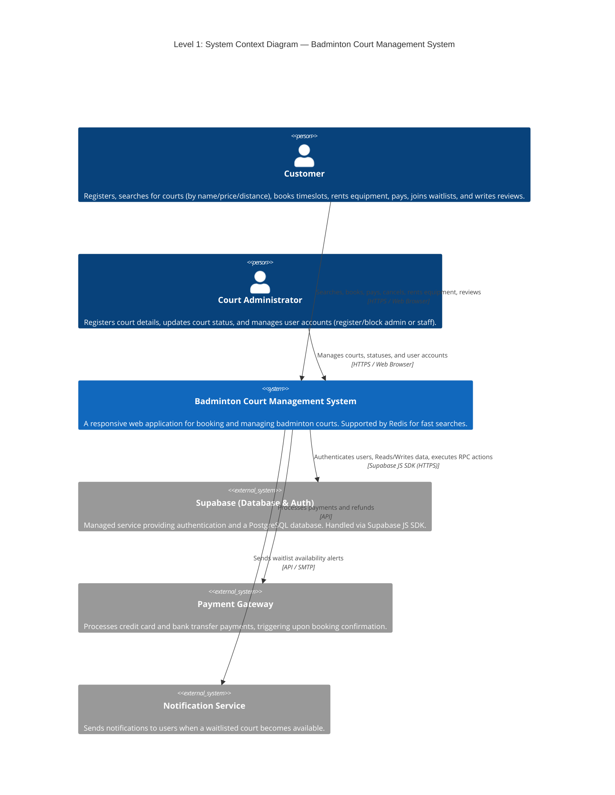
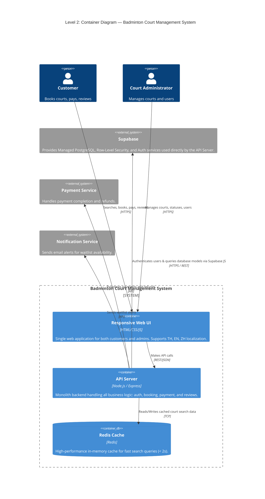
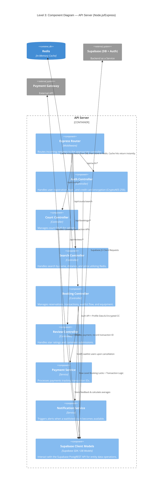
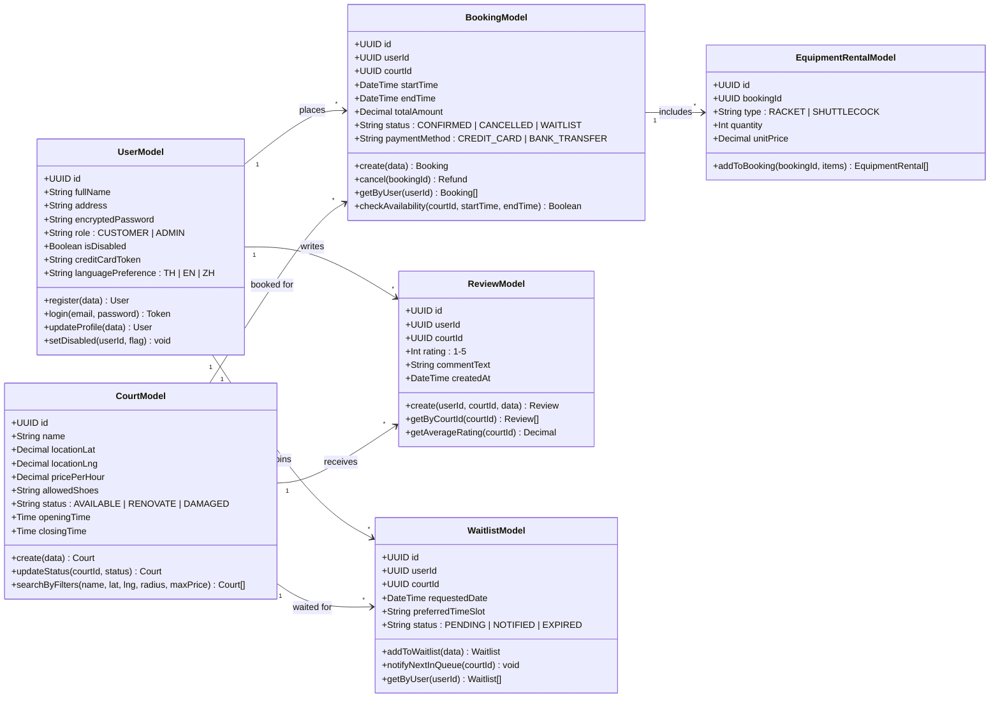
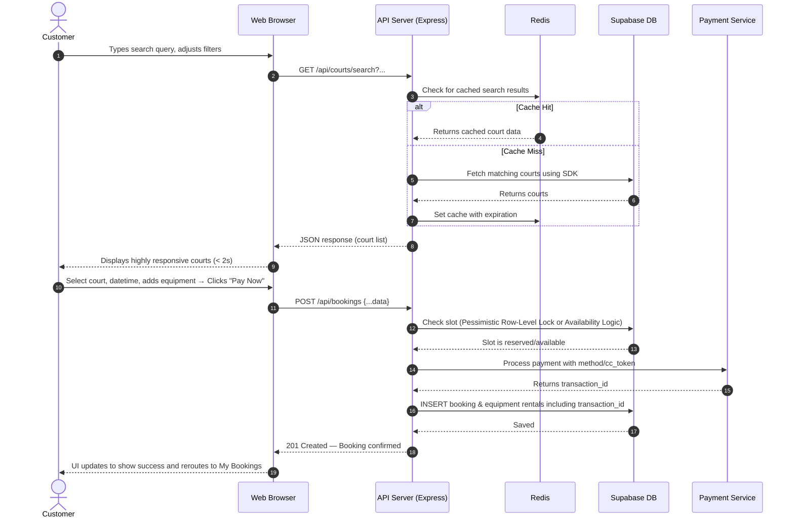
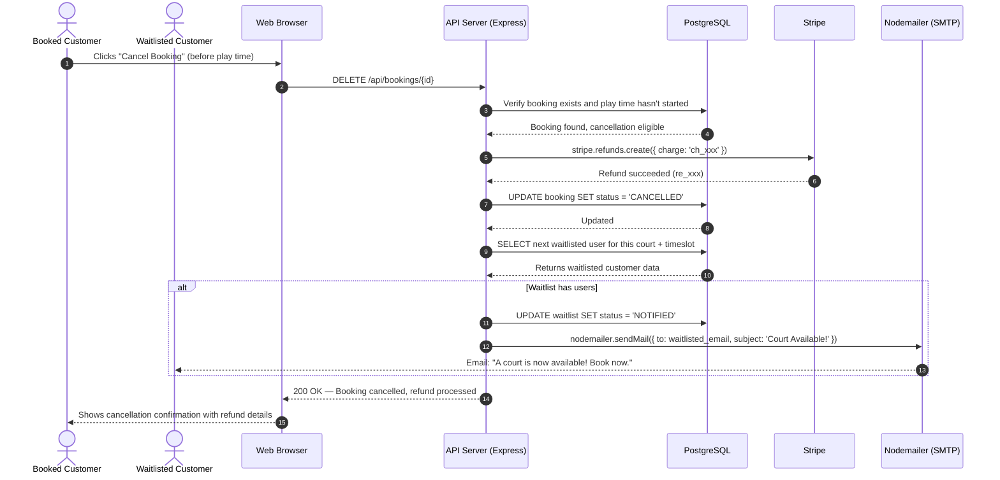
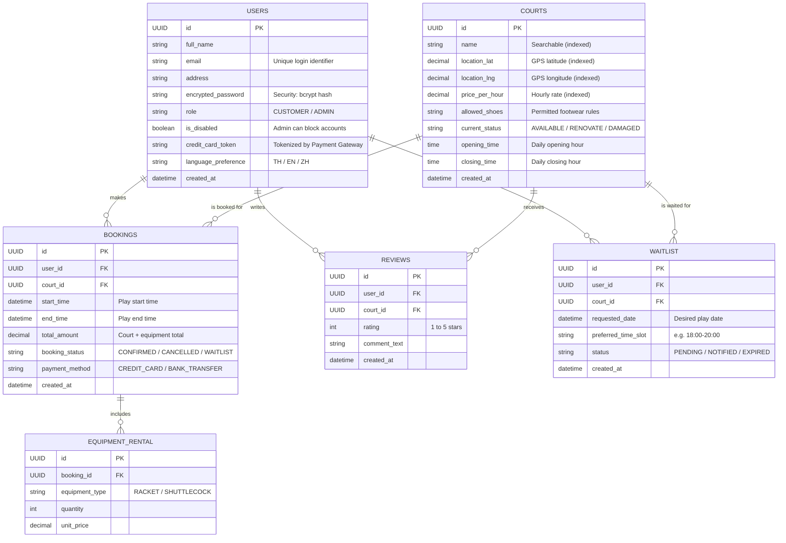

# Design Models and Design Rationale (Deliverable D1)

This document describes the software architecture of the **Badminton Court Management System** based on the project requirements. It includes C4 Model diagrams (Context, Container, Component), a Sequence Diagram for a core demo case, and an Entity Relationship (ER) Diagram to illustrate the system structure.

---

## 1. C4 Diagrams

### Level 1: System Context Diagram
An overview showing the relationship between the main system, the two types of users (Customer & Administrator), and the external third-party systems required to fulfill all functional and non-functional requirements.

**Design Rationale:**

| Requirement | How the Context Diagram Addresses It |
|---|---|
| **Concurrency (1,000 users)** | Handled by a single, well-optimized backend on Node.js using its non-blocking I/O event loop, further supported by **Redis Cache** for lightning-fast search indexing. |
| **Security (Encryption)** | All personal data (including credit cards) is encrypted using Node's `crypto` module AES-256 before being stored in the database. Authentication is offloaded securely to **Supabase Auth**. |
| **Search (Name/Distance/Price)** | Handled by the Court Search API and heavily optimized using **Redis Cache Support** ensuring response times of under 2 seconds. |
| **Waitlist & Notification** | Triggered upon booking cancellation, scanning the waitlist and using the **Notification Service** to dispatch alerts to the appropriate users on the waitlist. |
| **Payment & Cancellation** | The booking transaction checks availability and triggers a **Payment Gateway**. Full refund processes are triggered when a booking is correctly canceled within the allowed timeframe. |
| **Localization (TH/EN/ZH)** | Frontend web UI is designed to accommodate dynamic i18n translation switches seamlessly without reloading the server. |
| **Equipment Rental** | Included in the Customer's relationship label ("rents equipment"). Managed as part of the booking flow within the system. |
| **Review System (1-5 stars)** | Included in the Customer's relationship label ("reviews"). Average ratings are displayed alongside court search results. |

---

### Level 2: Container Diagram
The container-level view shows the simplified, monolithic technology stack designed for easy local deployment and high performance.

**Design Rationale:**
*   **Monolith API with Cache:** The main architecture uses Node.js/Express but offloads read-heavy operations (court searching) to **Redis**, achieving response times under 2 seconds.
*   **Single Responsive Web UI:** One web application serves both customers and administrators, fully eliminating the need for separate codebases while retaining responsive behavior across all mobile platforms.
*   **Supabase Database & Auth Integration:** The previous raw raw-SQL `pg` connection pool was phased out in favor of the full **Supabase JS Client SDK**. Queries, inserts, and authentications natively use Supabase, offloading backend complexity to the managed cloud ecosystem.
*   **Data Security:** Credit card endpoints parse info using Node.js `crypto` (AES-256) inside the Controller before sending encrypted tokens securely to the database.

---

### Level 3: Component Diagram (API Server)
The internal component structure of the monolith API Server, showing how business logic is organized into focused modules.

**Design Rationale:**
*   **Separation of Search from Standard Court Operations:** A dedicated **Search Controller** focuses purely on high-performance filtering. It integrates natively with **Redis** to intercept incoming search requests, bypassing database load on cache hits.
*   **Supabase over Raw Database Connectors:** The traditional `pg` driver component was purged completely in favor of the **Supabase JS Client** Models. This allows offloading auth and leveraging Supabase's managed SDK features internally.
*   **In-Memory Crypto:** The **Auth Controller** directly uses the Node.js `crypto` module (AES-256) to symmetrically encrypt user credit cards on registration ensuring PCI-DSS conceptual requirements without plain-text storage.
*   **Booking Transaction Flow:** The Booking Controller locks the available slot on the database level, fires off the Payment Service returning a `transaction_id`, and gracefully commits the result or aborts the slot reservation if payment fails.

---

### Level 4: Code Diagram (Data Access Layer)
The code-level view zooms into the **Data Access Layer** component from Level 3, showing the class structure and relationships between data models that map directly to the database tables.

**Design Rationale:**
*   **Model-per-Table Pattern:** Each model class maps 1:1 to a PostgreSQL table, making the codebase predictable. Methods on each model represent the actual database operations (CRUD + business queries).
*   **Waitlist as a Dedicated Model:** Separating the waitlist from bookings allows independent lifecycle management. A waitlisted entry can be `PENDING → NOTIFIED → EXPIRED`, while a booking follows `CONFIRMED → CANCELLED`.
*   **Security by Design:** `encryptedPassword` and `creditCardToken` fields are never stored in plain text. The `UserModel.login()` method compares against bcrypt hashes, and credit card tokens are generated by the external Payment Gateway.
*   **Language Preference:** Stored per-user to persist their TH/EN/ZH selection across sessions, fulfilling the localization requirement.

---

## 2. Sequence Diagrams

### 2.1 Search and Booking Flow (Happy Path)

A demonstration workflow when a customer searches for a court, selects a timeslot, adds equipment, and successfully completes a payment.

### 2.2 Cancellation and Waitlist Notification Flow

Demonstrates what happens when a user cancels a booking that has people waiting in the queue.

**Design Rationale:**
*   **Performance (< 2s Search):** The search flow uses PostgreSQL indexed queries combined with the external Map Service for distance calculations. Database indexes on `location`, `name`, and `price` fields ensure fast filtering without the need for a separate cache layer.
*   **Concurrency Safety (SELECT FOR UPDATE):** The booking flow uses database-level row locking (`SELECT FOR UPDATE`) to prevent double-booking race conditions when multiple users try to book the same timeslot simultaneously.
*   **Atomic Transactions:** The payment must succeed before the booking is committed to the database. If the payment fails, the slot remains available. This is wrapped in a single database transaction to ensure data integrity.
*   **Waitlist-to-Notification Pipeline:** When a booking is cancelled, the system automatically checks the waitlist and notifies the next user via the external Notification Service, ensuring no manual intervention is needed.

---

## 3. Entity Relationship Diagram (ER Diagram)

The database schema design for the Badminton Court Management System using a Relational Database.

**Design Rationale:**
*   **`is_disabled` in USERS:** Fulfills the requirement giving Administrators the authority to block inappropriate customers from logging into the platform.
*   **`current_status` in COURTS:** Meets the requirement for real-time status updates (e.g., renovations or equipment damage) by admins. This status is actively read by the search service to prevent users from booking unavailable courts.
*   **`opening_time` / `closing_time` in COURTS:** Required by the admin court registration feature to specify operating hours.
*   **`language_preference` in USERS:** Persists the user's chosen language (TH/EN/ZH) for the localization requirement.
*   **`payment_method` in BOOKINGS:** Tracks whether payment was via credit card or bank transfer, as both methods are required.
*   **Dedicated WAITLIST table:** Separated from BOOKINGS to allow independent lifecycle management (PENDING → NOTIFIED → EXPIRED), enabling the notification system to efficiently query and alert waitlisted users.
*   **Normalized EQUIPMENT_RENTAL & REVIEWS tables:** Decoupling optional information keeps the core `BOOKINGS` table as small and performant as possible, benefiting read queries under 1,000 concurrent users.
*   **Database Indexes:** Fields marked "indexed" (court name, coordinates, price) are optimized for the < 2s search performance requirement.

